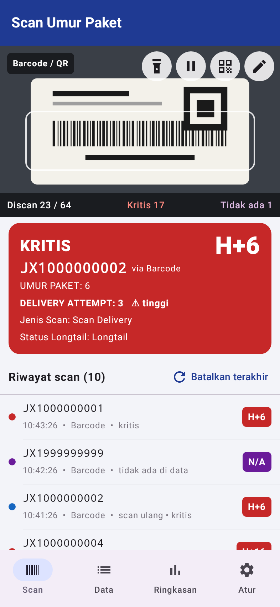
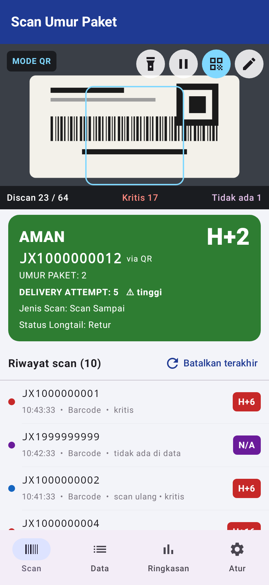
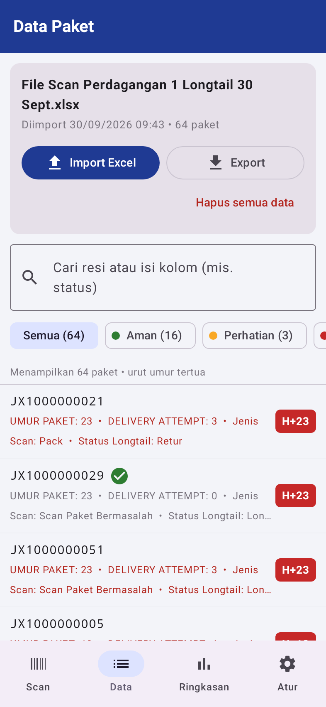
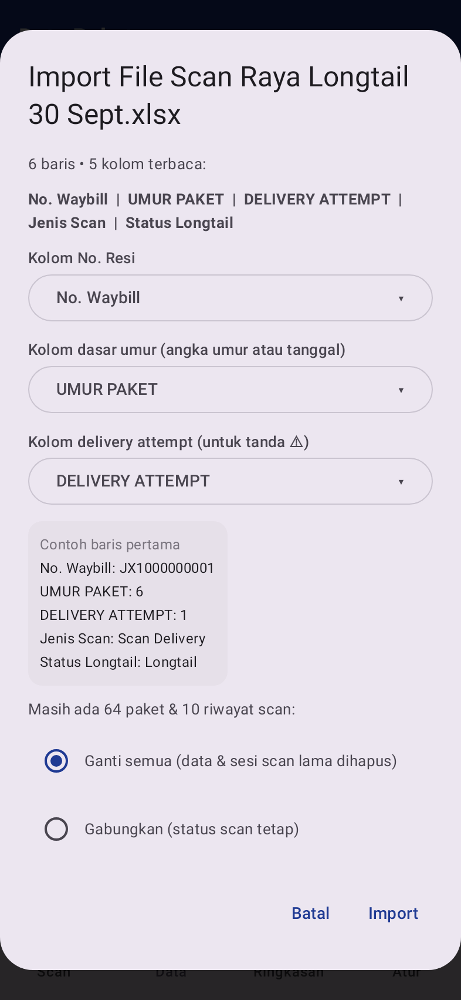
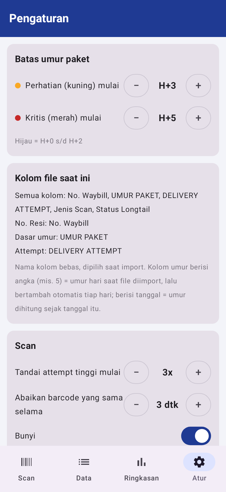
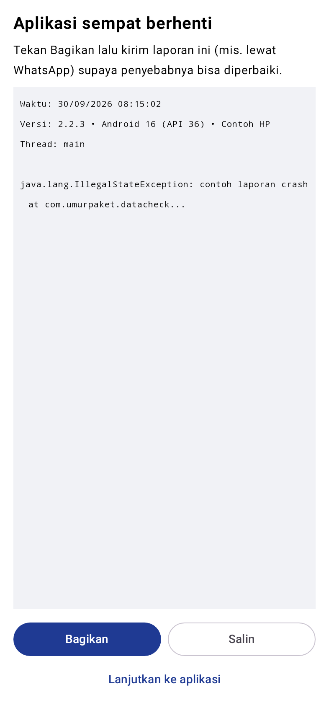
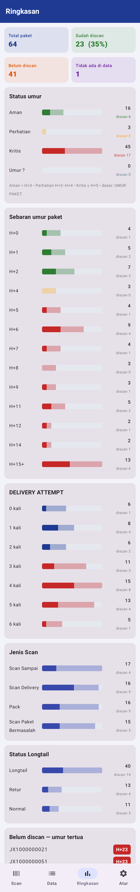
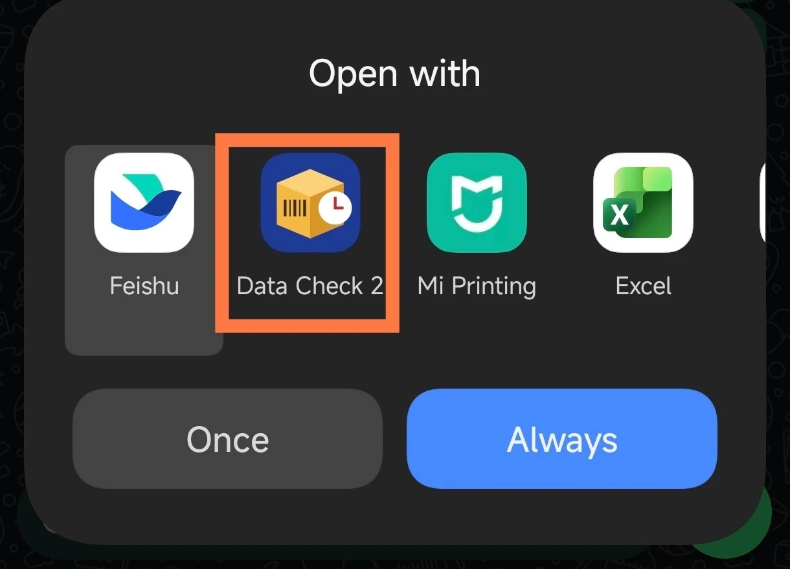

# Data Check 2 — Cek Umur Paket dengan Scan

Aplikasi Android untuk mengecek **umur paket (H+)** dengan memindai barcode/QR resi, berdasarkan file Excel data paket
(misalnya file paket longtail per DP). Cocok untuk stock opname, pengecekan paket stuck, dan pemantauan paket longtail.

Semua data tersimpan **di HP saja** — tidak ada data yang dikirim ke server.

## Fitur

- **Scan barcode & QR resi** dengan kamera, terus-menerus tanpa perlu menekan tombol.
- **Mode QR saja** untuk label yang barcode garisnya terlipat atau rusak.
- **Ketik resi manual** bila barcode dan QR sama-sama tidak terbaca.
- **Umur paket otomatis (H+)** dengan warna: 🟢 Aman, 🟡 Perhatian, 🔴 Kritis (batas bisa diatur).
- **Bunyi & getar berbeda** untuk tiap status, sehingga petugas tidak perlu terus melihat layar.
- **Penanda scan ulang** dan tombol **Batalkan terakhir** bila salah scan.
- **Kolom Excel bebas**: nama dan jumlah kolom apa saja (No Waybill, Umur Paket, Status Longtail, dll).
  Semua kolom tampil di aplikasi dengan nama aslinya.
- **Progres scan**: jumlah sudah/belum discan, kritis, dan resi yang tidak ada di data.
- **Ringkasan**: sebaran umur, delivery attempt, dan jumlah per kolom status.
- **Export ke Excel**: sheet Ringkasan, Hasil Scan, Belum Discan, dan Semua Data.
- Buka file Excel **langsung dari WhatsApp** / File Manager (“Open with → Data Check 2”) — lihat [Import data](#2-import-data).
- Laporan crash yang bisa dibagikan, bila aplikasi sempat berhenti.

## Tampilan

> Screenshot memakai data contoh (nomor resi palsu). Gambar kamera diganti ilustrasi label.

| Scan — hasil kritis | Scan — mode QR | Data paket |
|---|---|---|
|  |  |  |

| Import — pilih kolom | Pengaturan | Laporan crash |
|---|---|---|
|  |  |  |

<details>
<summary><b>Ringkasan</b> (klik untuk melihat)</summary>


</details>

## Cara Instal

1. Buka halaman **[Releases](../../releases)** repo ini dan unduh file **`Data-Check-2-vX.Y.Z.apk`** versi terbaru.
2. Buka file APK di HP. Bila muncul peringatan, izinkan **“Instal dari sumber tidak dikenal”** untuk aplikasi
   yang dipakai membuka file (misalnya File Manager atau WhatsApp).
3. Tekan **Instal**, lalu buka **Data Check 2**.
4. Saat pertama membuka tab Scan, izinkan akses **kamera**.

**Syarat:** Android 8.0 atau lebih baru.
**Update:** cukup pasang APK versi baru di atas versi lama — data dan riwayat scan tetap ada
(kecuali dinyatakan lain di catatan rilis).

## Cara Pemakaian

### 1. Siapkan file Excel

- Format **.xlsx** (atau .csv), **satu sheet**, dengan **judul kolom di baris pertama**.
- Minimal harus ada kolom **No. Resi / No Waybill**. Kolom lain bebas.
- Contoh format (lihat folder [`contoh/`](contoh)):

  | No. Waybill | UMUR PAKET | DELIVERY ATTEMPT | Jenis Scan |
  |---|---|---|---|
  | JX1000000001 | 7 | 2 | Scan Paket Bermasalah |

**Tips untuk file longtail:** dari file longtail gabungan yang dibagikan di grup, **filter per DP**, lalu sisakan
4 kolom saja: **No. Waybill, UMUR PAKET, DELIVERY ATTEMPT, Jenis Scan**. Simpan sebagai .xlsx dan kirim ke DP
masing-masing lewat WhatsApp. File lebih kecil dan kartu hasil scan lebih ringkas.

Kolom **umur** boleh berisi:

- **Angka** (`5`, `5 hari`, `H+5`) → dianggap umur **pada hari file diimport**, lalu bertambah otomatis setiap hari.
  Karena itu, **import file di hari yang sama dengan tanggal file**.
- **Tanggal** (`22/08/2026`, `2026-08-22`, sel tanggal Excel, dll) → umur dihitung sejak tanggal tersebut.

### 2. Import data

**Cara tercepat — langsung dari WhatsApp** (tanpa perlu menyimpan file dulu):

1. Di chat atau grup WhatsApp, ketuk file Excel yang dikirim (misalnya file longtail per DP).
2. Muncul pilihan **“Open with / Buka dengan”** → pilih **Data Check 2**.
3. Tekan **Once / Sekali saja**. (Jangan pilih **Always / Selalu**, supaya file Excel lain tetap bisa dibuka dengan Excel.)
4. Data Check 2 terbuka dan langsung menampilkan dialog import (lihat langkah 2 di bawah).



Cara yang sama berlaku dari **File Manager**, **Google Drive**, atau aplikasi lain: buka / bagikan (**Share**) file Excel → pilih **Data Check 2**.

**Atau dari dalam aplikasi:**

1. Buka tab **Data** → tekan **Import Excel**, pilih file.
2. Muncul dialog berisi semua kolom yang terbaca dan contoh baris pertama. Aplikasi otomatis memilih:
   - **Kolom No. Resi**
   - **Kolom dasar umur**
   - **Kolom delivery attempt** (untuk tanda ⚠ attempt tinggi)

   Ganti lewat tombol pilihan bila tebakannya kurang tepat.
3. Bila sudah ada data sebelumnya, pilih:
   - **Ganti semua** — data & sesi scan lama dihapus (untuk hari / stock opname baru).
   - **Gabungkan** — resi baru ditambahkan, status scan yang lama tetap.
4. Tekan **Import**.

### 3. Scan paket

Buka tab **Scan** dan arahkan kamera ke barcode resi. Hasil muncul dalam kartu berwarna:

| Warna | Arti | Bunyi |
|---|---|---|
| 🟢 Hijau | **AMAN** — umur di bawah batas perhatian | 1 bip pendek |
| 🟡 Kuning | **PERHATIAN** | 2 bip |
| 🔴 Merah | **KRITIS** | alarm |
| 🔵 Biru | **SUDAH DISCAN** sebelumnya (scan ulang) | bip ganda |
| 🟣 Ungu | **TIDAK ADA DI DATA** | bunyi error |

Tombol di bagian atas layar kamera (kiri ke kanan):

- 🔦 **Senter** — untuk tempat gelap.
- ⏸ **Jeda / lanjut** scan.
- **QR** — **mode QR saja**: bingkai berubah persegi, hanya QR yang dibaca. Pakai bila barcode terlipat/rusak.
- ✏️ **Ketik resi** — cek resi secara manual.

Tips: ketuk layar kamera untuk memfokuskan; untuk QR kecil di label, dekatkan kamera ±10–15 cm.
Salah scan? Tekan **Batalkan terakhir** di atas riwayat scan.

### 4. Lihat data & ringkasan

- **Data** — daftar paket urut umur tertua, bisa dicari (resi atau isi kolom apa pun) dan difilter
  (Aman / Perhatian / Kritis / Belum discan / Sudah discan).
- **Ringkasan** — total, sudah/belum discan, sebaran umur, delivery attempt, jumlah per kolom status,
  dan daftar paket belum discan yang paling tua.

### 5. Export laporan

Tab **Data** → **Export**, atau tab **Ringkasan** → **Export laporan Excel**. File berisi 4 sheet:
**Ringkasan**, **Hasil Scan** (waktu, status, sumber Barcode/QR/Ketik), **Belum Discan**, dan **Semua Data**.

Untuk memulai sesi baru tanpa import ulang: **Ringkasan → Mulai sesi scan baru**.

### 6. Pengaturan (tab Atur)

- Batas umur **Perhatian** dan **Kritis** (default H+3 dan H+5).
  Untuk file longtail yang semuanya ≥ H+5, naikkan batasnya (misalnya H+7 dan H+10) supaya warnanya bermakna.
- Batas **attempt tinggi**, jeda scan barcode yang sama, bunyi, dan getar.
- Tombol **Tes bunyi** untuk tiap status.

## Bila aplikasi berhenti (crash)

Saat dibuka kembali akan muncul layar **“Aplikasi sempat berhenti”**. Tekan **Bagikan** dan kirim laporannya
ke pengembang, lalu **Lanjutkan ke aplikasi** (aplikasi dibuka di tab Data agar kamera tidak langsung menyala).

## Build dari Source

Kebutuhan: Android Studio (JDK 21) dan Android SDK 36.

```bash
git clone https://github.com/rob541n7/data-check-2.git
cd data-check-2
./gradlew assembleDebug          # APK debug: app/build/outputs/apk/debug/
./gradlew testDebugUnitTest      # tes pembaca Excel, tanggal, QR, dll + membuat ulang screenshot di docs/screenshots
```

Build release yang ditandatangani: buat kunci dengan `keytool`, salin `keystore.properties.example` menjadi
`keystore.properties`, isi path & password-nya, lalu jalankan `./gradlew assembleRelease`.
**Simpan kunci dengan aman** — update aplikasi harus ditandatangani dengan kunci yang sama.
File kunci dan `keystore.properties` sengaja tidak ikut di repo.

Teknologi: Kotlin, Jetpack Compose (Material 3), CameraX, ML Kit Barcode Scanning (offline), SQLite.

## Riwayat Versi

| Versi | Perubahan |
|---|---|
| 2.2.4 | Tata letak layar Scan: tombol kamera berjejer (tombol Ketik resi tidak lagi tertutup), bingkai QR menyesuaikan area kamera, area kamera lebih lega di HP layar kecil |
| 2.2.3 | Pembacaan Excel streaming (memperbaiki kehabisan memori di Android 16); batas pengaman ukuran file |
| 2.2.2 | Kamera lebih stabil di berbagai HP; layar laporan crash dengan tombol Bagikan |
| 2.2.1 | Perbaikan crash saat scan (shrinking R8 dinonaktifkan); pencatat crash |
| 2.2 | Kolom Excel bebas + dialog pemetaan kolom; sel tanggal Excel terbaca sebagai tanggal |
| 2.1 | Mode QR saja; sumber scan (Barcode/QR/Ketik) dicatat |
| 2.0 | Tulis ulang aplikasi: umur otomatis berwarna, bunyi per status, ringkasan, export Excel |
